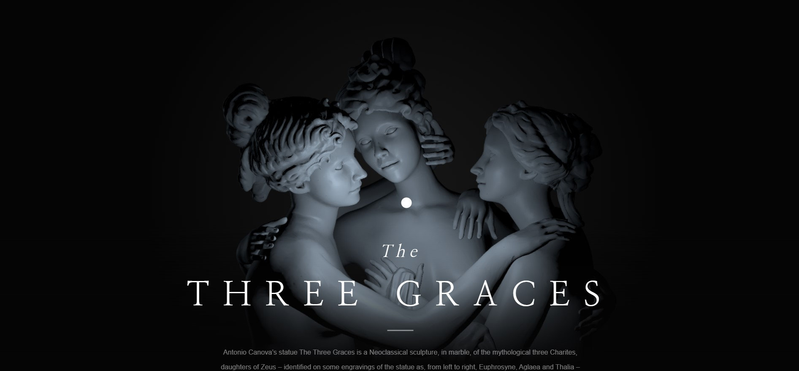

# Story Of The Three Graces using threejs
<h4>by Os Al Haddad</h4>

In this project, I wanted to show the difference 3d can make. just imagine this was a basic html and css website. 3D can take the website's interactivity and experience to another level.



This project uses Threejs in vanillaJS with WebPack.

# Live Link
Live: **

# Getting Started
Download and install Node.js on your computer (https://nodejs.org/en/download/).

Then, open VSCODE, drag the project folder to it. Open VSCODE terminal and install dependencies (you need to do this only in the first time)
```
npm install
```

Run this command in your terminal to open a local server at localhost:8080
```
npm run dev
```

# Notes
Would be really appreciated if you are willing to give me a star here on GitHub 🎉